# Acceso a la presentación {data-background-image="assets/art/pc.jpg" data-background-opacity="0.25"}

## {data-background-image="assets/art/pc.jpg" data-background-opacity="0.18"}

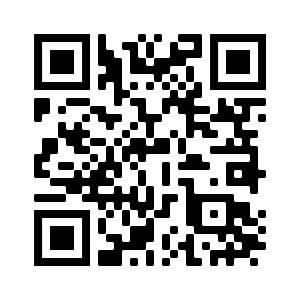{width=50%}

[https://pbeltran.github.io/elemfunc2eso2020](https://pbeltran.github.io/elemfunc2eso2020)

# ¿Qué dice el currículo? {data-background-image="assets/art/legislacion.jpg" data-background-opacity="0.15"}

## 1º ESO {data-background-image="assets/art/legislacion.jpg" data-background-opacity="0.15"}

## BLOQUE 2: Funciones (1º ESO)

**Contenidos**

:::incremental

- Coordenadas cartesianas: representación e identificación de puntos en un sistema de ejes coordenados. 
- El concepto de función: Variable dependiente e independiente. Formas de presentación (lenguaje habitual, tabla, gráfica, fórmula). 
- Funciones de proporcionalidad directa. Representación.

:::

:::notes

:::

## Criterios de evaluación (1º ESO) (CMCT)

:::incremental

- Crit.MA.4.1. Conocer, manejar e interpretar el sistema de coordenadas cartesianas.
- Crit.MA.4.2. Manejar las distintas formas de presentar una función: lenguaje habitual, tabla numérica, gráfica y ecuación, pasando de unas formas a otras y eligiendo la mejor de ellas en función del contexto.
- Crit.MA.4.3. Comprender el concepto de función. Reconocer, interpretar y analizar las gráficas funcionales.
- Crit.MA.4.4. Reconocer, representar y analizar las funciones de proporcionalidad directa, utilizándolas para resolver problemas.

:::

## 2º ESO {data-background-image="assets/art/legislacion.jpg" data-background-opacity="0.15"}

## BLOQUE 2: Funciones (2º ESO)

**Contenidos**

:::incremental

- Coordenadas cartesianas: representación e identificación de puntos en un sistema de ejes coordenados. 
- El concepto de función: Variable dependiente e independiente. Formas de presentación (lenguaje habitual, tabla, gráfica, fórmula). Crecimiento y decrecimiento. Continuidad y discontinuidad. Cortes con los ejes. Máximos y mínimos relativos. Análisis y comparación de gráficas.
- Funciones lineales. Cálculo, interpretación e identificación de la pendiente de la recta. Representaciones de la recta a partir de la ecuación y obtención de la ecuación a partir de una recta.
- Utilización de calculadoras gráficas y programas de ordenador para la construcción e interpretación de gráficas

:::

:::notes

:::

## Crit.MA.4.1 (2º ESO)

Conocer, manejar e interpretar el sistema de coordenadas cartesianas (CMCT)

- Est.MA.4.1.1. Localiza puntos en el plano a partir de sus coordenadas y nombra puntos del plano escribiendo sus coordenadas.

## Crit.MA.4.2 (2º ESO)

Manejar las distintas formas de presentar una función: lenguaje habitual, tabla numérica, gráfica y ecuación, pasando de unas formas a otras y eligiendo la mejor de ellas en función del contexto.

- Est.MA.4.2.1. Pasa de unas formas de representación de una función a otras y elige la más adecuada en función del contexto. 

## Crit.MA.4.3 (2º ESO)

Crit.MA.4.3. Comprender el concepto de función. Reconocer, interpretar y analizar las gráficas funcionales.

- Est.MA.4.3.1. Reconoce si una gráfica representa o no una función.

## 3º ESO Académicas {data-background-image="assets/art/legislacion.jpg" data-background-opacity="0.15"}

## BLOQUE 2: Funciones (3º ESO Ac.)

**Contenidos**

:::incremental

- Análisis y descripción cualitativa de gráficas que representan fenómenos del entorno cotidiano y de otras materias. 
- Análisis de una situación a partir del estudio de las características locales y globales de la gráfica correspondiente.
- Análisis y comparación de situaciones de dependencia funcional dadas mediante tablas y enunciados. 
- Utilización de modelos lineales para estudiar situaciones provenientes de los diferentes ámbitos de conocimiento y de la vida cotidiana, mediante la confección de la tabla, la representación gráfica y la obtención de la expresión algebraica. 
- Expresiones de la ecuación de la recta.
- Funciones cuadráticas. Representación gráfica. Utilización para representar situaciones de la vida cotidiana.

:::

:::notes

:::

## Crit.MAAC.4.1 (3º ESO Ac.)

Conocer los elementos que intervienen en el estudio de las funciones y su representación gráfica. CMCT.

- Est.MAAC.4.1.1. Interpreta el comportamiento de una función dada gráficamente y asocia enunciados de problemas contextualizados a gráficas.
- Est.MAAC.4.1.2. Identifica las características más relevantes de una gráfica interpretándolas dentro de su contexto.
- Est.MAAC.4.1.3. Construye una gráfica a partir de un enunciado contextualizado describiendo el fenómeno expuesto.
- Est.MAAC.4.1.4. Asocia razonadamente expresiones analíticas a funciones dadas gráficamente.

## Crit.MAAC.4.2 (3º ESO Ac.)

Identificar relaciones de la vida cotidiana y de otras materias que pueden modelizarse mediante una función lineal valorando la utilidad de la descripción de este modelo y de sus parámetros para describir el fenómeno analizado. CMCT-CIEE.

- Est.MAAC.4.2.1. Determina las diferentes formas de expresión de la ecuación de la recta a partir de una dada (Ecuación punto pendiente, general, explícita y por dos puntos), identifica puntos de corte y pendiente, y la representa gráficamente.
- Est.MAAC.4.2.2. Obtiene la expresión analítica de la función lineal asociada a un enunciado y la representa.
- Est.MAAC.4.2.3. Formula conjeturas sobre el comportamiento del fenómeno que representa una gráfica y su expresión algebraica.

## Crit.MAAC.4.3 (3º ESO Ac.)

Reconocer situaciones de relación funcional que necesitan ser descritas mediante funciones cuadráticas, calculando sus parámetros y características. CMCT-CD.

- Est.MAAC.4.3.1. Calcula los elementos característicos de una función polinómica de grado dos y la representa gráficamente.
- Est.MAAC.4.3.2. Identifica y describe situaciones de la vida cotidiana que puedan ser modelizadas mediante funciones cuadráticas, las estudia y las representa utilizando medios tecnológicos cuando sea necesario.

## 4º ESO Académicas {data-background-image="assets/art/legislacion.jpg" data-background-opacity="0.15"}

## BLOQUE 2: Funciones (4º ESO Ac.)

**Contenidos**

:::incremental

- Interpretación de un fenómeno descrito mediante un enunciado, tabla, gráfica o expresión analítica.
- Análisis de resultados.
- La tasa de variación media como medida de la variación de una función en un intervalo. 
- Reconocimiento de otros modelos funcionales: aplicaciones a contextos y situaciones reales.

:::

:::notes

:::

## Crit.MAAC.4.1 (4º ESO Ac.)

Identificar relaciones cuantitativas en una situación, determinar el tipo de función que puede representarlas, y aproximar e interpretar la tasa de variación media a partir de una gráfica, de datos numéricos o mediante el estudio de los coeficientes de la expresión algebraica. CMCT-CCL.

- Est.MAAC.4.1.1. Identifica y explica relaciones entre magnitudes que pueden ser descritas mediante una relación funcional y asocia las gráficas con sus correspondientes expresiones algebraicas
- Est.MAAC.4.1.2. Explica y representa gráficamente el modelo de relación entre dos magnitudes para los casos de relación lineal, cuadrática, proporcionalidad inversa, exponencial y logarítmica, empleando medios tecnológicos, si es preciso.

## Crit.MAAC.4.1 (4º ESO Ac.)

- Est.MAAC.4.1.3. Identifica, estima o calcula parámetros característicos de funciones elementales.
- Est.MAAC.4.1.4. Expresa razonadamente conclusiones sobre un fenómeno a partir del comportamiento de una gráfica o de los valores de una tabla.
- Est.MAAC.4.1.5. Analiza el crecimiento o decrecimiento de una función mediante la tasa de variación media calculada a partir de la expresión algebraica, una tabla de valores o de la propia gráfica.
- Est.MAAC.4.1.6. Interpreta situaciones reales que responden a funciones sencillas: lineales, cuadráticas, de proporcionalidad inversa, definidas a trozos y exponenciales y logarítmicas.

## Crit.MAAC.4.2 (4º ESO Ac.)

Analizar información proporcionada a partir de tablas y gráficas que representen relaciones funcionales asociadas a situaciones reales obteniendo información sobre su comportamiento, evolución y posibles resultados finales. CMCT-CD-CAA.

- Est.MAAC.4.2.1. Interpreta críticamente datos de tablas y gráficos sobre diversas situaciones reales.
- Est.MAAC.4.2.2. Representa datos mediante tablas y gráficos utilizando ejes y unidades adecuadas.

## Crit.MAAC.4.2 (4º ESO Ac.)

- Est.MAAC.4.2.3. Describe las características más importantes que se extraen de una gráfica señalando los valores puntuales o intervalos de la variable que las determinan utilizando tanto lápiz y papel como medios tecnológicos.
- Est.MAAC.4.2.4. Relaciona distintas tablas de valores y sus gráficas correspondientes.

## 3º ESO Aplicadas {data-background-image="assets/art/legislacion.jpg" data-background-opacity="0.15"}

## BLOQUE 2: Funciones (3º ESO Ap)

**Contenidos**

:::incremental

- Análisis y descripción cualitativa de gráficas que representan fenómenos del entorno cotidiano y de otras materias.
- Análisis de una situación a partir del estudio de las características locales y globales de la gráfica correspondiente.
- Análisis y comparación de situaciones de dependencia funcional mediante tablas y enunciados.
- Utilización de modelos lineales para estudiar situaciones provenientes de los diferentes ámbitos de conocimiento y de la vida cotidiana, mediante la confección de la tabla, la representación gráfica y la obtención de la expresión algebraica.
- Expresiones de la ecuación de la recta.
- Funciones cuadráticas. Representación gráfica. Utilización para representar situaciones de la vida cotidiana.

:::

:::notes

:::

## Cri.MAAP.4.1 (3º ESO Ap)

Conocer los elementos que intervienen en el estudio de las funciones y su representación gráfica. CMCT-CSC.

- Est.MAAP.4.1.1. Interpreta el comportamiento de una función dada gráficamente y asocia enunciados de problemas contextualizados a gráficas.
- Est.MAAP.4.1.2. Identifica las características más relevantes de una gráfica, interpretándolas dentro de su contexto.
- Est.MAAP.4.1.3. Construye una gráfica a partir de un enunciado contextualizado describiendo el fenómeno expuesto.
- Est.MAAP.4.1.4. Asocia razonadamente expresiones analíticas sencillas a funciones dadas gráficamente.

## Cri.MAAP.4.2 (3º ESO Ap)

Identificar relaciones de la vida cotidiana y de otras materias que pueden modelizarse mediante una función lineal valorando la utilidad de la descripción de este modelo y de sus parámetros para describir el fenómeno analizado. CMCT.

- Est.MAAP.4.2.1. Determina las diferentes formas de expresión de la ecuación de la recta a partir de una dada (ecuación punto-pendiente, general, explícita y por dos puntos) e identifica puntos de corte y pendiente, y las representa gráficamente.
- Est.MAAP.4.2.2. Obtiene la expresión analítica de la función lineal asociada a un enunciado y la representa.

## Cri.MAAP.4.3 (3º ESO Ap)

Reconocer situaciones de relación funcional que necesitan ser descritas mediante funciones cuadráticas, calculando sus parámetros y características. CMCT-CD-CAA.

- Est.MAAP.4.3.1. Representa gráficamente una función polinómica de grado dos y describe sus características.
- Est.MAAP.4.3.2. Identifica y describe situaciones cotidianas que pueden ser modelizadas mediante funciones cuadráticas, las estudia y las representa utilizando medios tecnológicos cuando sea necesario.

## 4º ESO Aplicadas {data-background-image="assets/art/legislacion.jpg" data-background-opacity="0.15"}

## BLOQUE 2: Funciones (4º ESO Ap)

**Contenidos**

:::incremental

- Interpretación de un fenómeno descrito mediante un enunciado, tabla, gráfica o expresión analítica.
- Estudios de otros modelos funcionales y descripción de sus características, usando el lenguaje matemático apropiado. Aplicación en contextos reales.
- La tasa de variación media como medida de la variación de una función en un intervalo.

:::

:::notes

:::

## Crit.MAAP.4.1 (4º ESO Ap) 

Identificar relaciones cuantitativas en una situación, determinar el tipo de función que puede representarlas. Aproximar e interpretar la tasa de variación media a partir de una gráfica, de datos numéricos o mediante el estudio de los coeficientes de la expresión algebraica.

- Est.MAAP.4.1.1. Est.MAAP.4.1.2 Identifica y explica relaciones entre magnitudes que pueden ser descritas mediante una relación funcional (lineal, cuadrática, proporcionalidad inversa y exponencial), asociando las gráficas con sus correspondientes expresiones algebraicas.

## Crit.MAAP.4.1 (4º ESO Ap) 

- Est.MAAP.4.1.3. Identifica, estima o calcula elementos característicos de estas funciones (cortes con los ejes, intervalos de crecimiento y decrecimiento, máximos y mínimos, continuidad, simetrías y periodicidad).
- Est.MAAP.4.1.4. Expresa razonadamente conclusiones sobre un fenómeno, a partir de la gráfica que lo describe o de una tabla de valores.

## Crit.MAAP.4.1 (4º ESO Ap) 

- Est.MAAP.4.1.5. Analiza el crecimiento o decrecimiento de una función mediante la tasa de variación media, calculada a partir de la expresión algebraica, una tabla de valores o de la propia gráfica.
- Est.MAAP.4.1.6. Interpreta situaciones reales que responden a funciones sencillas: lineales, cuadráticas, de proporcionalidad inversa y exponenciales.

## Cri.MAAP.4.2 (4º ESO Ap) 

Analizar información proporcionada a partir de tablas y gráficas que representan relaciones funcionales asociadas a situaciones reales, obteniendo información sobre su comportamiento, evolución y posibles resultados finales.

- Est.MAAP.4.2.1. Interpreta críticamente datos de tablas y gráficos sobre diversas situaciones reales.
- Est.MAAP.4.2.2. Representa datos mediante tablas y gráficos utilizando ejes y unidades adecuadas.

## Cri.MAAP.4.2 (4º ESO Ap) 

- Est.MAAP.4.2.3. Describe las características más importantes que se extraen de una gráfica utilizando tanto lápiz y papel como medios informáticos.
- Est.MAAP.4.2.4. Relaciona distintas tablas de valores y sus gráficas correspondientes en casos sencillos, justificando y argumentando la decisión.
- Est.MAAP.4.2.5. Utiliza con destreza elementos tecnológicos específicos para dibujar gráficas.

# Hablemos sobre funciones

## No es algo tan fácil

La construcción del _concepto_ de función es un proceso largo y difícil para el alumnado. Involucra diferentes aspectos: 

- Obtener o presentar información.
- Resaltar una tendencia en la evolución de una magnitud.
- Hacer predicciones a corto plazo.
- Analizar la existencia de una relación entre dos variables.

. . .

> Se puede (debe) hacer una aproximación "informal" a las funciones en las primeras fases de obtención, interpretación y comunicación de información.

## Formas de presentar una función

Una función puede presentarse mediante: 

- Descripciones verbales (orales o escritas)
- Representaciones gráficas
- Tablas
- Fórmulas o expresiones algebraicas

. . .

> No hacen falta fórmulas ni expresiones algebraicas para introducir las características globales (tendencia, periodicidad, etc.), y locales de las funciones (extremos, cortes, etc.).

## Representaciones gráficas y verbales

:::incremental

- Están presentes en muchas **situaciones cotidianas** en las que se intercambia información. Podemos usar en clase gráficas tomadas de Internet.
- El estudio de **gráficas reales** pone de manifiesto conceptos que en abstracto son difíciles de comprender.
- El enfoque **verbal y gráfico** es más asequible para los alumnos. Permite dedicarse a las ideas fundamentales (conceptos) y no simplemente al cálculo. 

:::

## Representaciones gráficas y verbales

:::incremental
- Un tratamiento **cualitativo** centrado en las características globales de las gráficas.
- Un acercamiento **reflexivo y con significado** a los aspectos cuantitativos:
	- Representación de puntos.
	- Elección y efecto de la escala en los ejes.
	- Dibujo de curvas a partir de tablas de valores.
	- Etc.
:::

# Actividades y recursos: el libro del Shell Centre

## El lenguaje de funciones y gráficas

:::::::::::::: {.columns}

::: {.column width="35%"}

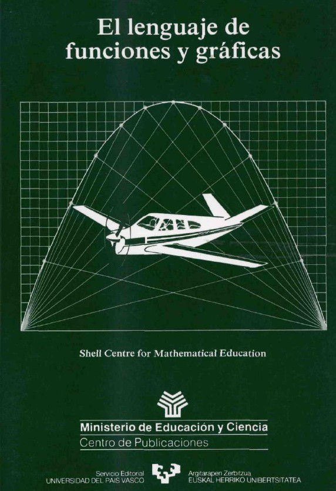{width=60%}  

[Descargar](https://sede.educacion.gob.es/publiventa/el-lenguaje-de-funciones-y-graficas/pedagogia/1065)

:::

::: {.column width="65%"}

Estos materiales sirven para ayudar a los alumnos a desarrollar fluidez en la utilización del lenguaje matemático de gráficas, tablas y álgebra de cara a describir y analizar situaciones del mundo real.

:::
:::::::::::::

## Ambiente de clase

Las tareas planteadas y la forma de _hacer matemáticas_ contribuyen a crear un ambiente en clase que anime a una discusión meditada en la que los alumnos intenten comprender o comunicar información.

## Estructura del libro

:::incremental

- **Unidad A**: se aborda la interpretación y bosquejo de los gráficas. Se centra en el estudio cualitativo de las mismas basado en la interpretación de sus características globales.
- **Unidad B**: se descubren y exploran situaciones realistas, centrándose en la búsqueda de patrones y su expresión en forma verbal, gráfica y finalmente algebraica.
- Modelos de preguntas de examen.
- Una colección de problemas (problemas y gráficas y otros datos para interpretar).
- Materiales de apoyo. Sobre la forma de trabajar o la evaluación.
:::

## Unidad A

Lo de los niveles es muy, pero que muy orientativo. 

|                                             	| Nivel propuesto 	|
|---------------------------------------------	|-----------------	|
| A1. Interpretación de puntos.               	|       1º ESO    	|
| A2. ¿Son las gráficas solamente dibujos?    	|       1º ESO     	|
| A3. Dibujo de gráficas a partir de textos.  	|       1º-2º ESO  	|
| A4. Diseño de gráficas a partir de dibujos. 	|       1º-2º ESO  	|
| A5. Mirando gradientes.                     	|       3º ESO     	|

## Unidad B

|                                                 	| Nivel propuesto 	|
|-------------------------------------------------	|-----------------	|
| B1. Realización de gráficas a partir de tablas. 	|     2º ESO     	|
| B2. Descubriendo funciones en situaciones.      	|     2º-3º ESO    	|
| B3. Funciones exponenciales.                    	| 	  4º ESO    	|
| B4. Una función de varias variables.            	|     4º ESO       	|

## Abordando un problema en grupo: un paseo por el campo

Eligiendo diferentes etiquetas para los ejes, la gráfica puede representar muchos paseos diferentes. 

{width=60%}  

. . .

> Actividad: pensemos en cinco diferentes paseos por el campo.

## Abordando un problema en grupo: paseos por el campo

Las etiquetas podrían ser:

:::incremental
- «Distancia a casa» para el eje vertical y «tiempo transcurrido» para el eje horizontal. 
- «Nivel de ansiedad» frente a «hambre». 
:::

. . .

Para cada idea, copiad la gráfica superior, etiquetad los ejes, poned un nombre al paseo y escribid una corta descripción del paseo por el campo concreto que está ilustrando la gráfica.

## Abordando un problema en grupo

>El Caballo y Los Perros

Salimos de casa y caminamos tranquilamente durante un rato. Al final llegamos a «El Caballo y Los Perros»; estaba bien para sentarse en el jardín y disfrutar de un bien ganado descanso y unas jarras de cerveza. Pasó el tiempo y de repente nos dimos cuenta de que debíamos apresurarnos si queríamos llegar a casa antes del anochecer: estábamos preocupados de estar mucho tiempo fuera a causa de los niños.

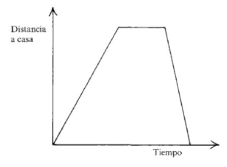{width=25%}  

## Abordando un problema en grupo

>El Sendero Desconocido

Teníamos que seguir una ruta bastante difícil y no era fácil encontrar los mojones. Estábamos cada vez más preocupados, pero al cabo de un rato Claude descubrió que la lejana colina debía ser Beacon's Hang y pensamos que estábamos en la dirección correcta. El camino se fue haciendo más familiar y estuvimos seguros de estar en el sendero correcto. Desgraciadamente, habíamos olvidado traer nuestros bocadillos.

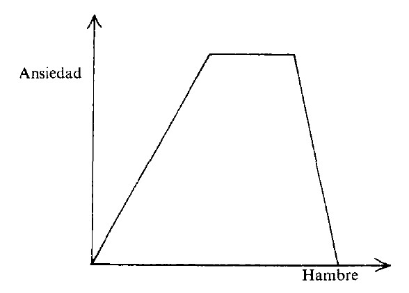{width=25%}  

## Abordando un problema en grupo: actividad 2

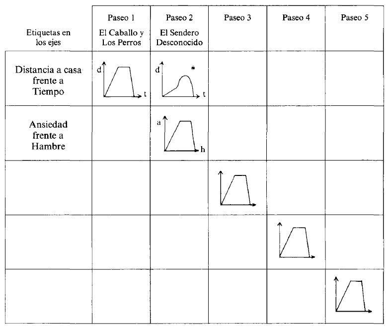{width=70%}  

## Abordando un problema en grupo: actividad final

:::incremental
1. ¿Habrías preferido pensar sobre las actividades individualmente antes de discutirlas con tu grupo?
2. ¿Cómo se ha organizado el grupo...
	- ... para registrar sus decisiones?
	- ... para preparar su presentación a los otros grupos?
:::

## Abordando un problema en grupo: actividad final

:::incremental	
3. ¿Qué papel jugó cada miembro del grupo en la discusión? ¿Hubo alguien que...
	- ...dominó?
	- ... trabajó independientemente de los demás?
	- ... hizo un montón de preguntas?
	- ... ofreció sugerencias?
	- ... recogió o rebatió sugerencias ofrecidas por los demás?
4. ¿Cómo se organizó la sesión de puesta en común? ¿Cada grupo tuvo la oportunidad de explicar sus hallazgos?
:::

## Guía para las discusiones de aula

> Ser fundamentalmente un **moderador** o **facilitador** que:

:::incremental
- Dirige el curso de la discusión y da a todos la oportunidad de participar.
- No interrumpe ni permite a los demás interrumpir al que habla.
- Valora todas las opiniones y no impone su propio punto de vista.
- Ayuda a los alumnos a clarificar sus ideas en sus propios términos.
:::

## Guía para las discusiones de aula

> Ser ocasionalmente un **interrogador** o **provocador** que:

:::incremental
- Introduce una nueva idea cuando la discusión decae.
- Investiga un punto de vista.
- Hace de abogado del diablo.
- Enfoca a un concepto importante.
- Evita realizar preguntas múltiples, dirigistas, retóricas o cerradas, que sólo requieran respuestas monosilábicas.
:::

## Guía para las discusiones de aula

> No ser nunca un **juez** o **evaluador** que:

:::incremental
- Valora todas las respuestas con un «sí», «bien», «interesante », etc. A menudo esto dificulta que a los demás aporten ideas alternativas, y predispone más hacia resultados exteriormente aceptables que hacia un diálogo exploratorio.
- Resume prematuramente.
:::

## Interpretación de puntos

¿Quién está representado por cada punto del diagrama?

:::::::::::::: {.columns}

::: {.column width="49%"}

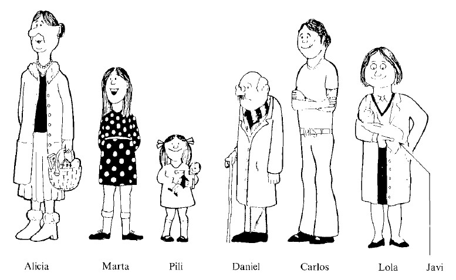{width=80%}  

:::

::: {.column width="49%"}

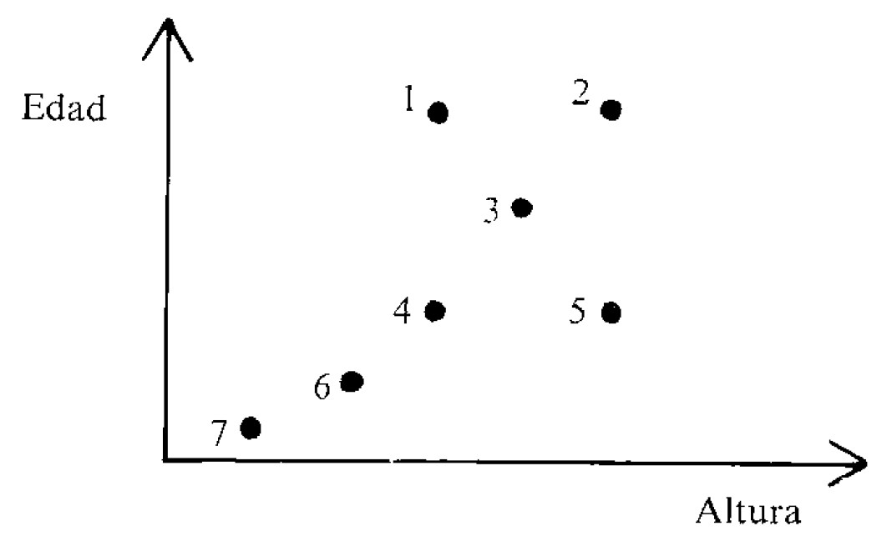{width=90%}  

:::
:::::::::::::

## Interpretación de puntos

En el escaparate de una papelería hay cinco cajas de rotuladores, A, B, C, D y E de varios tamaños (12, 24 y 36 rotuladores) y precios (2 €, 4 € y 6 €). La gráfica describe las características de las cajas:

- ¿Qué caja sale a mejor precio?
- ¿Qué caja sale a peor precio?

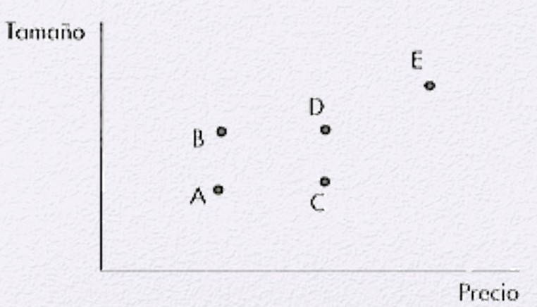{width=60%}  

## Interpretación de puntos

Cada una de estas cuatro figuras tiene un área de 36 unidades cuadradas.

- Marca 4 puntos en el gráfico inferior con las letras A, B, C y D.
- ¿Puedes dibujar una quinta figura de 36 unidades cuadradas que corresponda al 5." punto? Explícalo.
- Dibuja un diagrama que represente a todos los rectángulos con un área de 36 unidades cuadradas.
- ¿Qué sucede si incluyes en tu gráfica todas las figuras con el mismo área?

:::::::::::::: {.columns}

::: {.column width="65%"}

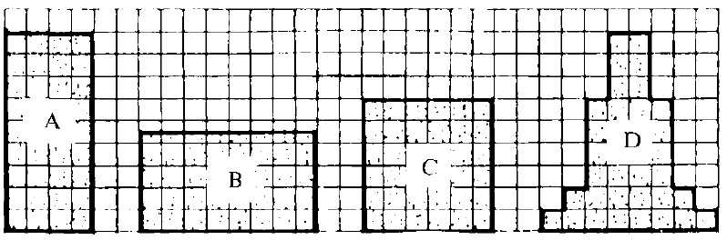{width=95%}  

:::

::: {.column width="35%"}

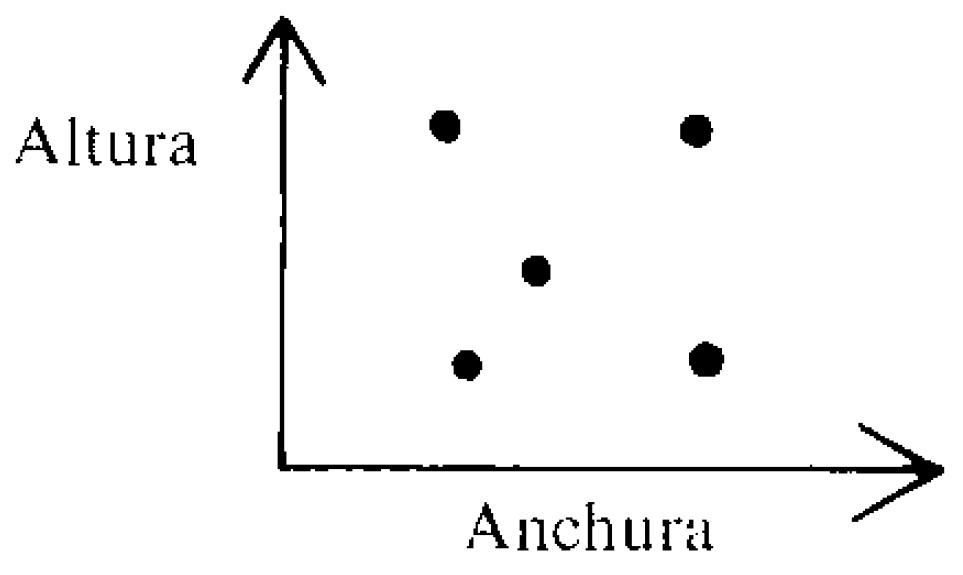{width=95%}  

:::
:::::::::::::

## Gráficas a partir de textos 

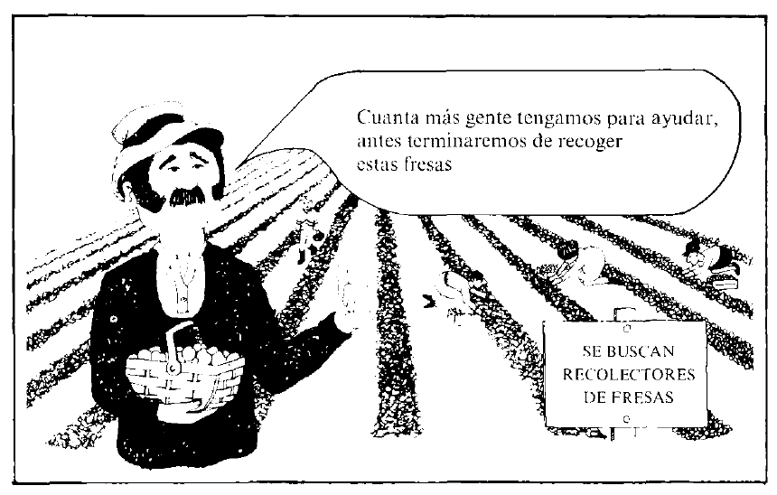{width=65%}  

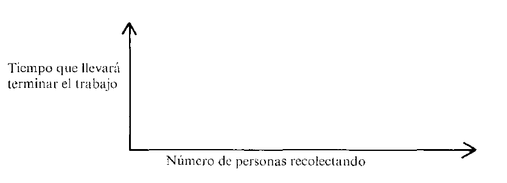{width=50%} 

## Gráficas a partir de textos 

Compara tu gráfica con las de tus compañeros. Intenta llegar a un acuerdo sobre la versión correcta. Escribe cómo has llegado a tu respuesta.

- ¿Debería ir la gráfica «hacia arriba» o «hacia abajo»? ¿Por qué?
- ¿Debería ser la gráfica una línea recta? ¿Por qué?
- ¿La gráfica debería cortar los ejes? Si es así, ¿dónde? Si no, ¿por qué no?

## ¿Son las gráficas solamente dibujos?

¿Cómo cambia la velocidad de la bola cuando va por el aire en este golpe de golf?

- Discute esta situación con tu compañero y escribe una descripción clara, indicando cómo creéis que varía la velocidad de la bola.
- Ahora haz una gráfica aproximada para ilustrar tu descripción:

:::::::::::::: {.columns}

::: {.column width="50%"}

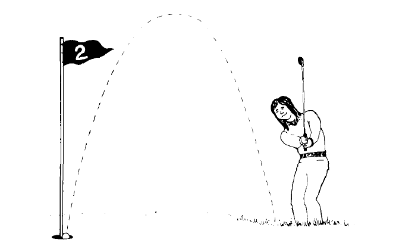{width=95%}  

:::

::: {.column width="50%"}

{width=95%}  

:::
:::::::::::::

## ¿Son las gráficas solamente dibujos?

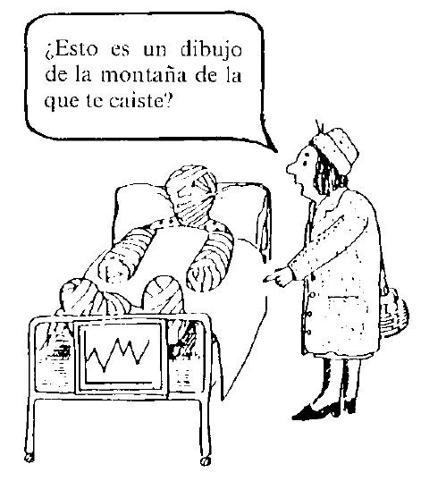{width=55%}  

## Gráficas a partir de dibujos
 
Pedro intentó resolver la cuestión del golf y dibujó una gráfica como esta:

- Coméntalo.
- ¿Puedes sugerir por qué hizo la gráfica así?
- ¿Ves alguna relación entre el intento de Pedro y el dibujo?

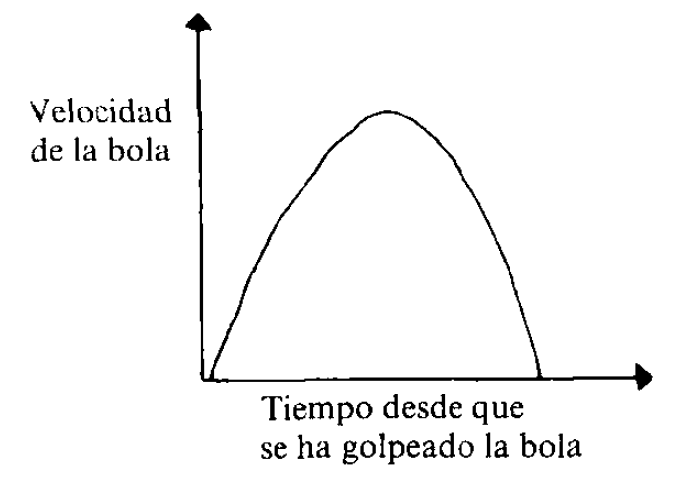{width=50%}  

## Gráficas a partir de dibujos 

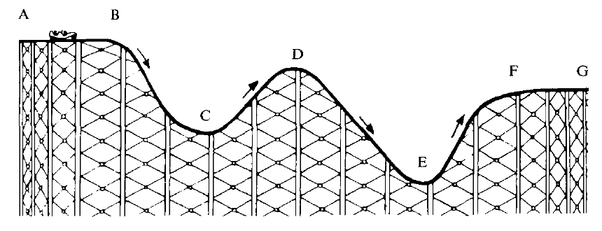{width=70%}  

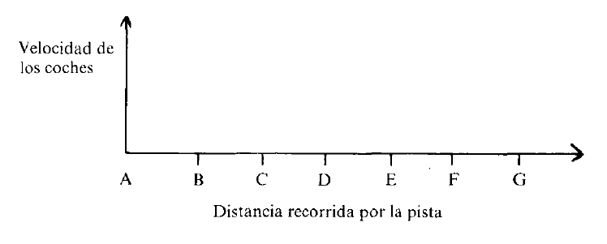{width=70%}  

## Gráficas a partir de dibujos 

¿Cómo crees que varía la velocidad de un coche cuando está dando la segunda vuelta en cada uno de los tres circuitos dibujados abajo?
(S = punto de salida).

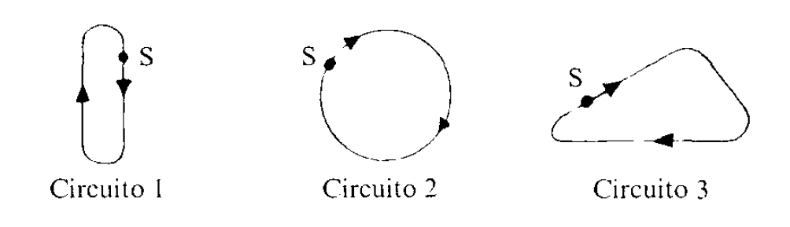{width=70%}  

{width=50%}  

## Gradientes

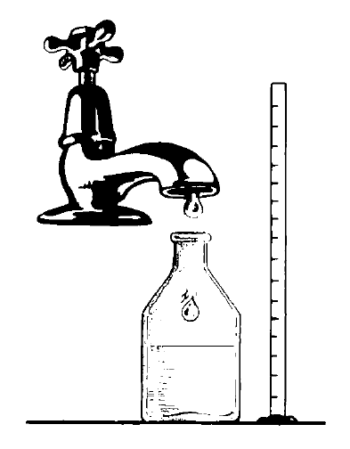{width=25%}  

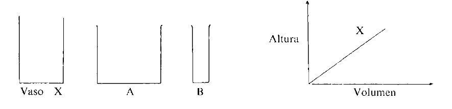{width=85%}  

## Gradientes

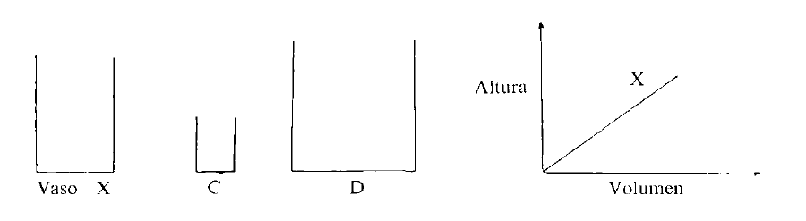{width=85%} 

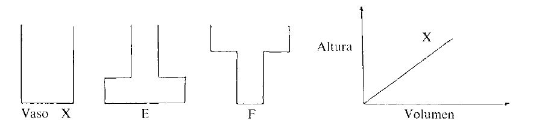{width=85%}  

## Gradientes

:::::::::::::: {.columns}

::: {.column width="50%"}

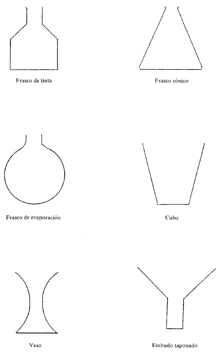{width=85%}  

:::

::: {.column width="50%"}

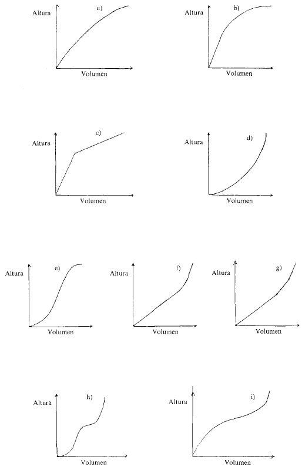{width=85%}  

:::
:::::::::::::

## Gráficas a partir de tablas 

Sin marcar los puntos exactamente, intenta realizar una gráfica aproximada que describa la relación entre la altura del globo y la distancia al horizonte.

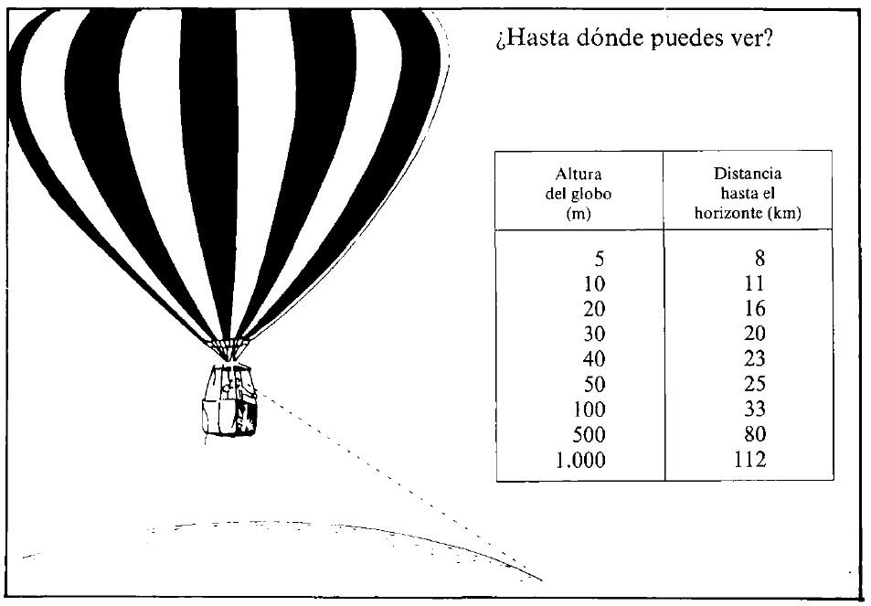{width=65%}

## Gráficas a partir de tablas 

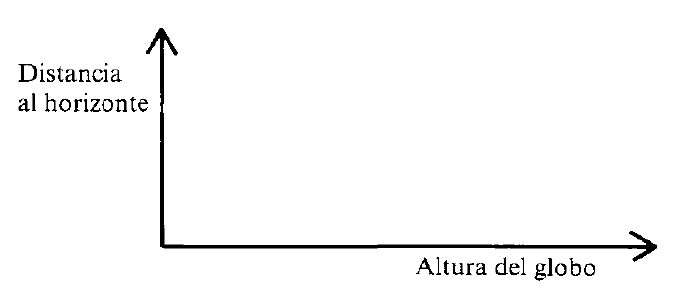{width=95%}

## Funciones en situaciones 

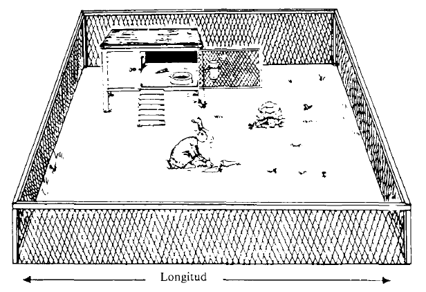{width=85%}

## Funciones en situaciones 

Hay que construir una conejera rectangular con 22 metros de valla metálica. El dueño está interesado en saber cómo depende el área cercada
por la valla de la longitud de la conejera. Piensa detenidamente sobre esta situación y discútela con tu compañero.

- Describe, por escrito, cómo cambiará el área al aumentar la longitud, tomando todos los valores posibles.
- Ilustra tu respuesta con una gráfica:

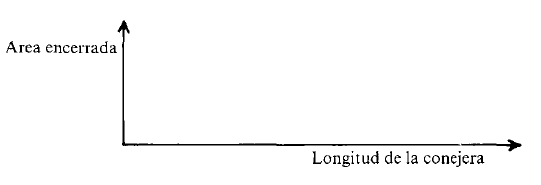{width=55%}

## Evaluación

Las preguntas de examen pretenden evaluar y reconocer los siguientes procesos:

1. Interpretación de representaciones matemáticas mediante palabras o dibujos.
2. Traducción de textos o dibujos a representaciones matemáticas.
3. Traducción entre representaciones matemáticas.
4. Descripción de relaciones funcionales mediante palabras o dibujos.
5. Combinación de información presentada en varias formas, y extracción de inferencias donde corresponda.
6. Uso de representaciones matemáticas para resolver problemas surgidos de situaciones realistas.
7. Descripción o explicación de los métodos utilizados y de los resultados obtenidos.

## Actividad de calificación

Una actividad de calificación 1. Considera las preguntas «Camping», «Yendo a la escuela» y «Carrera de vallas» e intenta decidir qué proceso se está examinando en cada parte del problema. Luego rellena la tabla de procesos.

## Actividad de calificación

Considera ahora el problema del «Camping». 

- Decide cuántos puntos deberían asignarse a cada parte. (La puntuación total para esta pregunta es de 15 puntos). 
- Discútelo con tus colegas. 
- ¿Discrepáis en el peso de cada parte? Intentad resolver las discrepancias. 

Haced lo mismo para «Yendo a la escuela» (que también vale 15 puntos).

## La carrera de vallas

- Es difícil diseñar un esquema de calificación para «La carrera de vallas» y la estrategia anterior no es aplicable a esta pregunta. Las respuestas de los alumnos pueden ser extremadamente variadas. 
- Responde tú mismo al problema y luego discute qué puntos consideras que son más importantes de mencionar. Haz una lista. Puede ser algo larga —y solo hay 8 puntos para esta pregunta; por lo tanto, intenta decidir qué factores consideras de mayor importancia.

## Evaluación de la carrera de vallas

A continuación, se dan seis textos de alumnos para esta pregunta. Léelos todos una vez antes de intentar evaluarlos. Sobre la base de tu impresión general ordénalos de mejor a peor. (Todavía no discutas con tus compañeros este orden.) 

- Escribe tu clasificación. 
- A continuación, compara la lista de factores que consideras importantes con las listas elaboradas por tus compañeros y con el esquema de calificación propuesto en el libro.

## Esquema de calificación propuesto en el libro para la carrera

Interpretación mediante textos de una representación matemática

- 1 punto por «C toma el primer puesto».
- 1 punto por «C deja de correr».
- 1 punto por «B supera a A».
- 1 punto por «B gana».

. . .

2 puntos por cualesquiera cuatro de los siguientes:

«A y B pasan a C»
«C empieza a correr de nuevo»
«C corre a menos velocidad»
«A frena» o «B acelera»
«A termina el segundo» o «C termina el último».

##

Puntuación parcial:

- 1 punto por dos o tres cualesquiera de los puntos mencionados.
- 2 puntos por un comentario animado que mencione las vallas.

. . .

Puntuación parcial:
- 1 punto por un comentario animado que no mencione las vallas o por un informe que mencione las vallas.

En total se pueden conceder 8 puntos para esta cuestión.

## Pregunta de examen...

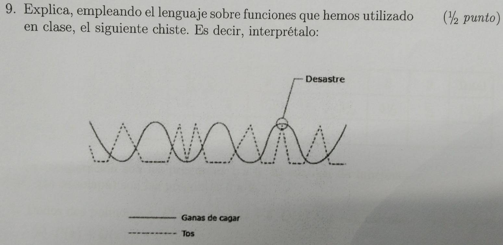{ width=70% }

## Ejemplos de respuestas

{ width=60% }

[https://twitter.com/pbeltranp/status/1126743840168103936](https://twitter.com/pbeltranp/status/1126743840168103936)

# Desmos

## 

https://teacher.desmos.com/

[Actividades de funciones](https://teacher.desmos.com/collection/5da6476150c0c36a0caf8ffb)

# Otros recursos

## WODB {data-background-image="assets/images/wodb_logo.jpg" data-background-opacity="0.15"}

{ width=50% }

 [www.wodb.ca](https://wodb.ca/)
 
Imagen: libro de Danielson (2016). 

## Ejemplo de WODB de funciones

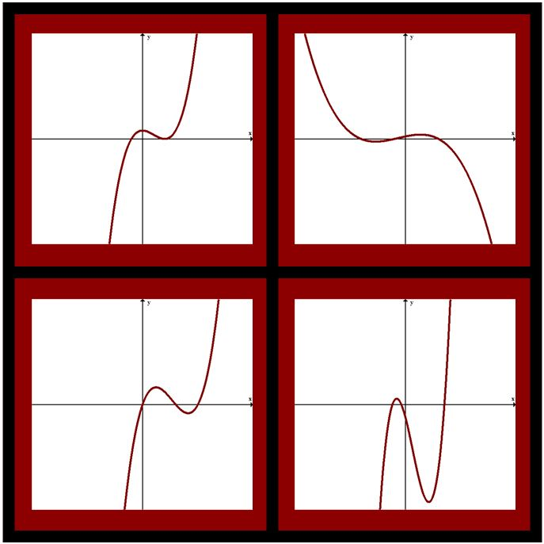{ width=65% }

[www.wodb.ca](https://wodb.ca/)

## Role-playing para los sistemas de coordenadas

[https://www.youtube.com/watch?v=4mPKUYpTkSU](https://www.youtube.com/watch?v=4mPKUYpTkSU)

  
# Dificultades

##

Leinhardt, Zaslavsky, and Stein (1990):

1. Confundir la pendiente con la altura.
2. Confundir intervalo y punto.
3. Considerar un gráfico como si fuese una imagen o un mapa. 
4. Concebir el gráfico como si estuviese hecho de puntos discretos.

# Creencias sobre las matemáticas y su enseñanza {data-background-image="assets/art/class.jpg" data-background-opacity="0.18"}

## Visión de las matemáticas {data-background-image="assets/art/clase.jpg" data-background-opacity="0.1"}

- El proceso de enseñanza y aprendizaje es una negociación de significados. 
	- Significado personal.
	- Significado de referencia, institucional. 

>¿Qué visión de las matemáticas queremos transmitir?

## Creencias sobre la enseñanza de las matemáticas {data-background-image="assets/art/clase.jpg" data-background-opacity="0.1"}

Hay un consenso en que la resolución de problemas debería ser el eje central de la enseñanza y el aprendizaje de las matemáticas. Acerca de ello, hay que considerar tres perspectivas:

::: incremental

- Enseñar **para** resolver problemas. 
- Enseñar **a través** de la resolución de problemas. 
- Enseñar **sobre** resolución de problemas. 

:::

. . .

Para indagar un poquito sobre esto: [Gaulin \(2001\)](http://www.hezkuntza.ejgv.euskadi.eus/r43-573/es/contenidos/informacion/dia6_sigma/es_sigma/adjuntos/sigma_19/7_Tendencias_Actuales.pdf)

## A través de la resolución de problemas {data-background-image="assets/art/clase.jpg" data-background-opacity="0.1"}

>¿El objetivo general de usar la RP en el aula de matemáticas debería ser enseñar la RP per se, o enseñar contenido matemático, usando la RP como vehículo? 

:::incremental
- Autores como Anderson (2014) atribuyen el bajo desempeño en RP de los estudiantes al tratamiento _tradicional_ de la RP en el aula, independiente y aislado del desarrollo de ideas, procesos y conceptos matemáticos básicos. 
- La RP a menudo toma la forma de problemas de aplicación al final de cada lección, presumiblemente para promover la capacidad de **aplicar** lo aprendido. Así rara vez se cumple el propósito de enseñar a resolver problemas o desarrollar o profundizar el conocimiento de ese contenido (Anderson, 2014). 
:::

## A través de la resolución de problemas {data-background-image="assets/art/clase.jpg" data-background-opacity="0.1"}

:::incremental
- Pero la atención (limitada) de la investigación sobre cómo se puede lograr el desarrollo de los conceptos a través de la RP indica que a la RP no se le ha dado un papel central en el plan de estudios, sino que se ha llevado a la periferia (Rigelman, 2013). 
- Se necesitan más estudios que exploren si ambas metas pueden lograrse a la vez, examinando el impacto del desarrollo conceptual impulsado por problemas en el desarrollo de competencias para la resolución de problemas (Lester y Charles, 2003; Schoen y Charles, 2003). 
:::

## {data-background-image="assets/art/clase.jpg" data-background-opacity="0.1"}

>Si bien los estudios más recientes favorecen la RP como un medio para desarrollar la comprensión del contenido matemático en lugar de un fin en sí mismo, el debate está lejos de resolverse.

English, L. D., & Gainsburg, J. (2016). Problem Solving in a 21st-Century Mathematics Curriculum. En L. D. English, & D. Kirshner (Eds.), _Handbook of International Research in Mathematics Education_, pp. 313-335. Routledge.

# Créditos y referencias {data-background-image="assets/art/credits.jpg" data-background-opacity="0.1"}

## Lista de referencias {data-background-image="assets/art/credits.jpg" data-background-opacity="0.1"}

Beltrán-Pellicer, P., Giacomone, B., & Burgos, M. (2018). Online educational videos according to specific didactics: the case of mathematics / Los vídeos educativos en línea desde las didácticas específicas: el caso de las matemáticas. _Cultura y Educación, 30_(4), 633-662. doi: 10.1080/11356405.2018.1524651. [Enlace](https://www.tandfonline.com/eprint/r8gbHE2dM75Z3t3wdE7U/full)

Beltrán-Pellicer, P., Godino, J. D. (2019). An onto-semiotic approach to the analysis of the affective domain in mathematics education. _Cambridge Journal of Education_, 1-20. DOI: 10.1080/0305764X.2019.1623175. [Enlace](https://www.tandfonline.com/eprint/KimkMTSJt9uGibVg9Gej/full?target=10.1080/0305764X.2019.1623175) 

## Créditos {data-background-image="assets/art/credits.jpg" data-background-opacity="0.1"}

_Compartir el conocimiento de forma libre es una buena práctica._

En estas diapositivas se han utilizado materiales disponibles en abierto y se han citado las fuentes correspondientes. El contenido de la presentación está publicado con licencia Creative Common [CC-BY-SA-4.0](https://creativecommons.org/licenses/by-sa/4.0/legalcode.es), lo que quiere decir que puedes compartirla y adaptarla, citándonos (Pablo Beltrán-Pellicer y José Mª Muñoz-Escolano) y poniendo un enlace a [https://pbeltran.github.io/unaempresadocente-videos/](https://pbeltran.github.io/unaempresadocente-videos/).

_Siéntete libre de trabajar con este material y de contactar conmigo para compartir tus reflexiones._

## {data-background-image="assets/art/credits.jpg" data-background-opacity="0.1"}

Presentación realizada con  <a href="https://revealjs.com/#/">Reveal.js</a>, <a href="https://pandoc.org/">Pandoc</a>, <a href="https://www.mathjax.org/">MathJax</a> y <a href="https://www.markdownguide.org/">Markdown</a>. El código fuente está disponible en [https://github.com/pbeltran/unaempresadocente-videos](https://github.com/pbeltran/unaempresadocente-videos)

La fuente de las imágenes es propia, salvo las que se ha citado la fuente en su diapositiva y las de dominio público obtenidas en [Unsplash](https://unsplash.com).

